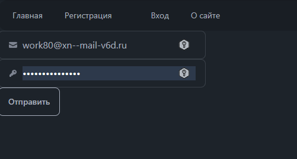
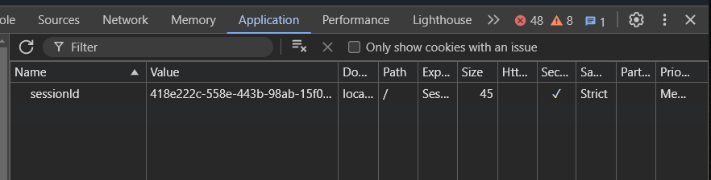
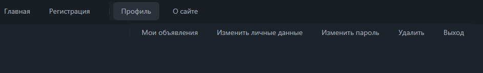
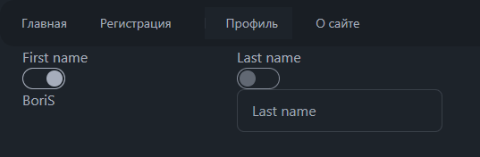
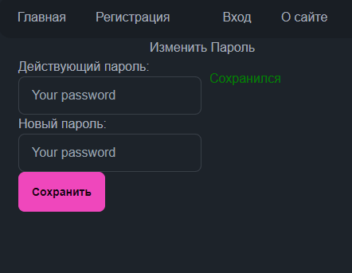
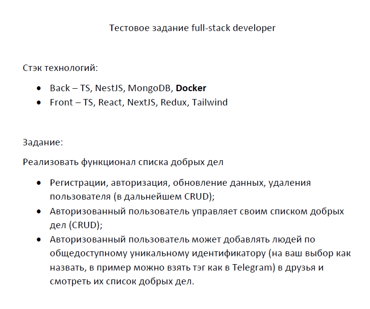

## Обзор
Проект имеет общее ядро. \
Дополнительно два sub-ядра (frontend, backend). \
sub-ядро backend имеет свои зависимости и наследуются зависимовти из ядра. От sub-ядра frontend закрыт файлами config, ignore.
sub-ядро backend  свои зависимости, в основном имеет в ядре проекта. Не стал утруждаться в связи с тестовым проектом. \
Весь проект настроен так , что при жеданиии \
Зависимости используемые ТОЛЬКО во frontend - можно через копипаст вырезать из package (который в ядре) и вставить в package (который во frontend). \
Далее команды для установк из ядра проекта.
frontend, backend - имеют свои команды.
Кажле sub-ядро запускается отдельно друг от друга, разными командами из ядра проекта.

При необходимости необходимости проект мог бы и может содержать два ядра вместо одного (как сделать сейчас). \
Так как такого требования небыло, сделал моно (через worckspaces).

Про базу данных
- название базы, пользователя, пароли, и прочее - укажите в файле env.
- Все таблицы создаются в первом запуске.
- В последубщие запуски проходит проверка - наличия таблиз. Если таблица \
существует, ошибок ни каких не выpывает.

Весь код писался с учётом`Полиморфизма`.

Note!!
- "Зависимости" - модули из npm.
- "Ядро" - корень проекта.


## ENV
Файл `.env.example` переименуйте в `.env` и внесите свои данные.

## Команды
```text
// Установка зависимостей
`npm run install` или `npm run install package.json`

// Установить зависимовти backend (логика сервера)
`npm --workspace=backend run i package.json`

// Подключаем wf `tailwindcss`
`run npm cssstyle`

// Запустить проверки стиля для написанного кода
`run npm lint`

// Развернуть файлы (frontend) в режиме сборки
`npm run build:front`

// Развернуть файлы (backend)
`npm run build:back`

// Для работы с проектом запустить сервер (frontend)
`npm run server:front`

// Для работы с проектом запустить сервер (backend)
`npm run server:back`

// Запуск husk который в автоматическом режиме будет реагировать на
// команды коммита (`git commit`) и запускать `lint`
`npm run prepare`

// Для установки дополнительных зависимостей, общих для frontend и  backend
`npm -W i ....`

// Для установки дополнительных зависимостей на backend
`npm  --workspace=backend i ....`

// Для установки дополнительных зависимостей на frontend
`npm  --workspace=frontend i ....`
```


## История
### 13.08
Настроена рабочая среда, в том числе eslit и Husky дл автоматической проверки.\


### 14.08
1. Создал мобильный модуль для логирования  при работе нв сервера. (можно и на фронте его использоваить). Разовая необходимость была. В последующий проекта уже не потребуется.
- Если файл содержит >= 2000 строк (уровень можно регулировать) файл удаялется и создается новый. \
- Пример файла
```test
16:25:10:37 ==> [server -> ERROR]: 'Users' Something that wrong!
     ERR-MEASSAGE: ошибка синтаксиса (примерное положение: "DEAFULT")
16:25:10:37 ==> [server]: "Emails" returning FALSE.
16:25:10:37 ==> [server]: END
16:27:38:15 ==> [server]: START
16:27:38:16 ==> [server]: Start the "Client" connection.
```
2. Запуск проекта вызывает логику ответственную за создание самой базы данных и создание двух таблиц в базе данных.  \
- Таблица Users связана с таблицей  Emails. \
- void prymaryInstalation();

3. роутер запросов на сервере  изначально писал на 'require("http");' \
- Данная библиотека слабая для большого проекта и закомментировал.
- Сделал набросок роутера на основе frameworke require("express")

На 15/08 надо писать sql для работы с REST API и совместить с роутерем запросов.

### 15.08
4. изменил серверный роутер . Добавил всего один sql для запроса с методом POST \

5. создано дерево файлов по маршруту `src\frontend\src\account`  работы с модулем `account`. \
- `src\frontend\src\account\components\Pages\index.tsx` создал роутер , для изменени контента страницы. \
- Подготовлен `fetch` запрос с методом POST.  Разместил в обработчике событий. \
- `src\frontend\src\account\services\cookies.ts` функцияя `getCookie` для кенерации куки в `params['headers']['X-CSRFToken']` из `fetch`

### На 16.08
- В обработчике событий получил данные из формы регистрации.
- Надо продумать логику аунтификации через email
- При авторици надо будет получить данные из базы.

### 17.08
 - форма регистрации оставляет сообщения (под формой) "Зарегистрирова"-зеленый или нет - красный.
 - форма регистрации если НЕ зарегистрирован  - данные остаются в форме. При регистрации форма стирает данные.
 - ИЗ формы авторизации уходит email и пароль \
 

 На странице роутера - `src\backend\src\server\router.ts` где пока ещё размещена вся логика:
 - получаем email из db согласно предоставленного email (из формы). Если пользователь не найден, отправляется 404 код.
 - если user найден (согласно email ) проверяем пользователя на соответствие пароля (А === В ). Если ДА - отправляем код "200" и "sessionId" для "cookie".
 - фронт получает сообщение. Если "404" код Пользователь видит сообщение "Что-то не получилось" (красный). Если "200" в течении сегунд видно сообщение "Вы вошли".
 - Устанавливаем "sessionId" в "cookie" (браузер со всеми ключами "почти") и "session_id" сохраняется в базу.



 - Под-меню на основе ключа cookie работает. Если ключь drop-нуть, на ссылках произойдет reset и "Профиль" не будет доступныйю Вернется "Вход".
 - При переходе по ссылкам (на обработанные страницы Главная, регистраци, Профиль) - под-менб рабочее.
 - Устанавливаем статус пользователю - 'true' в колонке 'is_active' (db).
 - B топ-меню изчезает ссылка "Вход"
 - На топ-меню становится доступным ссылка "Профиль"ю



Далее
 - ссылки из верхнего меню (родительские) получают класс 'active' при наведении и при клике (есть что шлифовать - тестирование показало).
 - Перенаправлчем пользователя, со страницы "Авторизация" на страницу профиля спустя 2 секунду после клика (для авторизации).


### 18.08 - 19.08
На страницу "`Профиль`"  (личный кабинет - ЛК) ФИО подгрузил и по рубильнику на поля с ФИО повесил.
Без авторизации данных не видно.
Разница очуществляется через CSS (на данный момент). Думал весь проект (ТЗ) за 3 дня надо сделать, \ согласно слов. Для полноценная разработка - sub-menu хранил бы в db (ячейка `texterea` *deafult - html:string-значение*).

При запускке профиля, вставлялось в React-DOM или DOM через `userEffect(()=>()=>{...thi's core ...})` .

- на форму первичной авторизации user-а добавил POST-запрос.\
 На сервере `router.post('/api/v1/inlogin/:sessionId', ....);` SQL (на основе `email` \ получаю все данные одного пользователя). \
 Это первичная порверка `session_id` на этапе авторизации (В дальнейшем без `session_id` не произойдет публикации интерфейса).
 Сервер, проверяю:
  - если имеется `session_id` в db,  возвращается код 200 и `session_id` в браузер сохраняет ключ из db.
  - если в db нет `session_id` возвращается код 404. Браузер создает и сохраняет новый ключ. (*Вот тут вопрос срока жизни ключа*).

Note!!:
1. Срок COOKIE в момент отключения браузера  - Вопрос не изучен (не брался за него). \
COOKIE при создании (первичная авторизация ) сохраняется в db. \
Могу отправить очередной запрос (это и сделал) на сервер, там отправить SQL и проверить наличие `session_id` исходя из `email`. 1-е это время. 2-е встает вопрос срока жизни COOKIE.
2. db имеет колонку `is_active`.  `true` как только пользователь авторизовался. \
Как только закрыли браузер, можно отреагировалть на данные событие (отправить сигнал в db) и через `1 800 000` милесеккунд `is_active = false`.

`src\frontend\src\account\components\Pages\Profile\handlers\handlerIde.ts` \
Далее часть функций реализовано через `document.createEleement()` и \
`Element.innerHTML.replace(..., ....)`. Тут больше вопрос безопасности. Поэтому код расстянулся. \


- `helperForHandlerSwhitches()` - добавляет/удаялет класс `active` в блок который является \
контейнером для dashbord-а.
- `handlerIdeFC()` - на событие `click` подвешивается обработчик `helperForHandlerSwhitches()`.
- `changeHtmlInner()` запускает UI для редактирования полей. В зависимости от нахождения \
 рубильника по которому произведен `click`  из поля `firstName` и (или) `lastName` получаем \
  старый контент, Рубильники работают в не зависимости друг от друга. Через \
   `basisRedactField()` создаем новые поля. \
Первый `click` по рубильнику публикует новое поле, Вторичный `click` (по томуже рубильнику) возвращает первоначально опубликованный UI.
- `basisRedactField()` - В DOM-е создаётся `input` (новые поля). Старый контент/поля \
 скрываю через CSS. На место старых полей встают новые. На новые поля подвешиваются новые обработчики событий `handlerEventOfInputPUT()`.
- `handlerEventOfInputPUT()` запускается при нажатии `Enter`. Отправляется запрос в db ` async function put(body_: string, pathnameStr = '/api/v1/clients/add/'):` из \
 `src\frontend\src\account\services\fetches.ts`. \
В зависимости от ответа сервера на display публикуется сообщение `'Сохранился', 'Не сохранился'`. С разными цветами.


### 20.08
На сервере, редактирование контента - \
Файл - `src\backend\src\server\router.ts`. \
Код - `router.put('/api/v1/clients/:sessionId',...)` \
Одна функция на все задачи/поля - В данный момент 2 поля - редактирование ФИО-user\
Работа с учером одного SQL-запроса `changeValueAllCellSQL(props: Put):` (SQL-запросы/функции ) из файла `src\backend\src\server\sql-functions\index.ts`.

### 21.08
- Добавлена страница для радактирования/изменения пароля. \
Weeb - `/profile/password_change`. \
Файл - `src\frontend\src\account\components\Pages\Profile\ProfileChanges\index.tsx` (`useEffect`, `useState`).

Обработчик `handlerClikOfInputPsw` события клика по кнопке (для сохранения нового пароля).
Файл - `src\frontend\src\account\components\Pages\Profile\ProfileChanges\handlers\handlersPsw.ts`.

При запуске обработчика `handlerClikOfInputPsw`, через node получаем данные из двух полей `input`. \
Из браузера получаем ключ `sessionId`. \
Старый пароль получаем из db по запросу `get`.
Проверка нового ключа на длину, на дублирует или не дублирует старый ключ. \
Отправляем новый ключ в db  по запросу `put`.
Ворма имеет различные сообщения для пользователя на разных этапах. \

Node. Серверная и фронтальная логика писалась на старых функциях. \
Новое добавлялись только УСЛОВИЯ



- Добавлена страница 'Удалить'. \
Web - `profile/profile_dalete`\
Файл - `src\frontend\src\account\components\Pages\Remove\index.tsx` (`useEffect`)
Обработчик клика `src\frontend\src\account\components\Pages\Remove\hamdlers\handlerRemove.ts`.

Файл - `src\backend\src\server\router.ts`. \
Код - ` router.delete('/api/v1/clients/:sessionId', ...)` \
SQL функция - `dropTableLineSQL`.

### 22.08
CRUD \
Файл - `src\backend\src\server\installation\index.ts` Добавил инсталяция таблицы для CRUD. \
Добавлена страница для CRUD \
Web - `/profile/ads` \
Файл - `src\frontend\src\account\components\Pages\Profile\Ads\index.tsx` \
Нажимаем на кнопку "Создать строчку" появляется форма для внесения новой записи. \
Согласно логике, форма для записи появляется над строками предыдущих записей (последние не реализованны до конца). \
На форму подвешивается прослушка событийю \
Событие "Enter" отправляет 'POST' запрос на сервер с новыми данными.


### 23/08
В ЛК \
CRUD продолжать
 - 'Мои объявления' - На страницу загружается весь список исходя из 'sessionId' (на момент загрузки/посещения страницы).
 - 'Создать строчку' - новые публикует поле для ввода нового заголовка.
 - 'Enter' сохраняет добавляет новую позицию в db.
 - 'Enter' в случае ошибки публикует сообщение пользователю.
 - Добавлена функция PUT
Добавлено ООП - чтоб редактировать свойства запроса на сервер и при этом использовать раннее написаныые функции. \
 `src\frontend\src\account\components\Pages\Profile\handlers\oop\inputForm.ts` + используются корректоры раннее написанных функций. \
 Как пример `src\frontend\src\account\services\fields.ts`.

### 24.8
  - Ручное тестирование показало дули при 2-ух или 3-х событиях. Откорректировано.
  - После редактирования контента, 'input' изчезает, возвращаются кнопки и строка. Все \
  Event-прослушки подвешаны.
  Выходной

### 25.08
  - CRUD - удаление одной строки/записи из списка завершено.
  - Авторизованный пользователь может регистрироровать людей.
  Выходной

### 26.08
   - На главной видим список зарегистрированный профилей (за минусом владельца сессии);
   - В не авторизованном режиме список всех зарегистрированный профилей.
   - В авторизованном режиме видим кнопку "Удалить из друзей".
   - Из главной переходим на страницу профиль - видим кнопку "Добавить в друзья".
   - Прямая ссылка на страницу "Профиль" - не видим кнопку "Добавить в друзья".
   - Клик по кнопке "Добавить в друзья" - добавляет строчку в DB.
   - Из главной (список всех зарегистрированных) переходим на страницу профиль - видим личные данные "Профиля".
   - Из главной (список всех зарегистрированных) переходим на страницу профиль. Затем в адресной строке вставляем свой ID - видим только dashbord без прочего интерфейса.
   - Прямая ссылка на страницу "Профиль" - видим личные даныые (страница пользователя).


## Note Totall:
 - ООП (можно сказать) не используется (в связи с тестовой работой).
 - На формах нет validators
 - При попытке редактировать сразу 2 поля (на странице Проыиль), Одно из полей не реагирует на 'Enter' для сохранения (пос копирования htmlelement).
 - Нет функции 'Выход' - не требовалось в задании.
 - Меняется cookie кключ (в браузере для dwbug режима, после перезапуска серверов.). В коде закладывалась проверка наличия ключа в DB.  Проверить функционал. - ИСПРАВЛЕНО

## Задание

